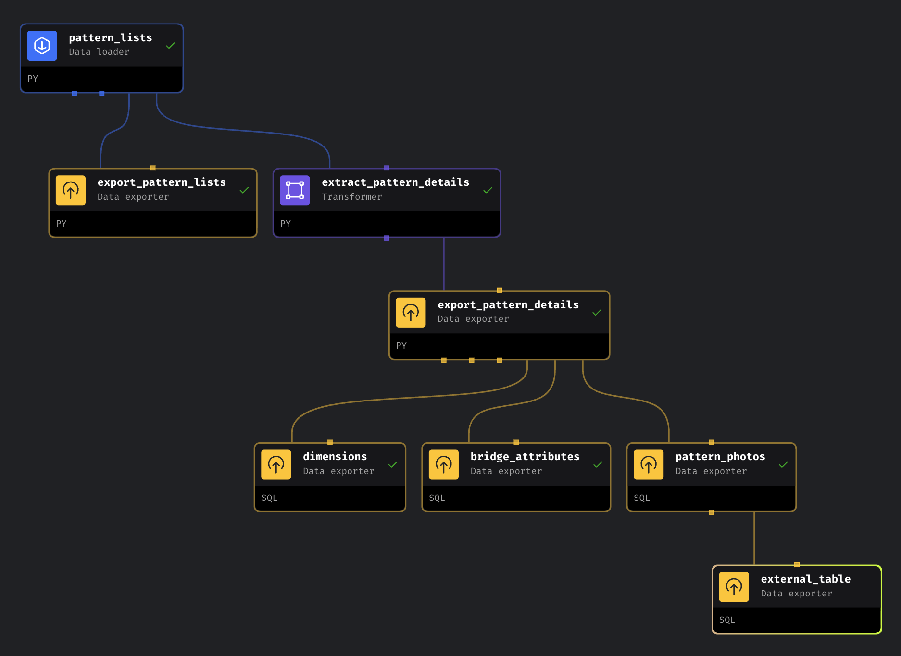

# Knit Sweater Pattern Recommendation Application
I’m building the Knit Sweater Pattern Recommendation, which will allow a user to upload a photo they have of a sweater and then get recommendations of knitting patterns on Ravelry that are similar to it.

This idea grew out of searching the Internet on my own for sweater patterns similar to those I'd see in TV shows, movies, and designer websites. I then discovered on Reddit that many other people were asking for "Sweater Dupes" as well, so I decided to build the initial sweater pattern recommender for my capstone for my RIT MS Data Science degree. However, the original process was messy and was mostly based locally on my computer, so I decided I was going to revamp the project with three goals in mind:

1. Improve Data Storage by using BigQuery and Google Cloud Storage (GCS) Bucket
2. Improve sweater recommendation accuracy
3. Build a live, usable application 

## Step One: Acquire Data via Ravelry

### Mage.AI ETL Process

This process downloads a list of patterns via the Ravelry API, uploads the list of patterns to Ravelry, downloads those pattern attributes from Ravelry, then uploads the attributes to BigQuery.

It also transforms the data in three specific ways:

- Creates a table called 'bridge_pattern_attributes' which unnests the list of attributes associated with patterns, creating a dedicated row for each attribute and the pattern its associated with.
- Creates a table called 'dim_patterns' that builds the primary look-up table for the catalog of sweater patterns.
- Creates a table called 'dim_pattern_photos'  which unnests the medium2_urls from the photo object for each pattern and stores them as their own row, while creating a column for sort order to maintain the order in which they were listed in the original Ravelry listing. 

### Image Downloading Process

The last step in acquiring data from Ravelry was to download images and upload them to Google Cloud Storage in the image_downloading.py file, downloading no more than 5 images for each pattern and storing them by pattern_ID. 

## Step Two: Create and Load Vectors to BigQuery

Next, feature extraction is performed on the sweater images 

### YOLO_Pose_Crop.py

This serves as a pre-processing step, helping to isolate the sweater from busy backgrounds that are frequently found in Ravelry images. It uses yolov8m-seg and yolov8m-pose models to detect person objects. It attempts a "Smart Crop" utilizing key coordinates (shoulders and hips) to define padding metrics around the torso. If a pose cannot be localized with high confidence, it seamlessly falls back to the full segmentation mask bounds to extract the "person" from the image with a structural padding buffer. 

This file also includes a safety net to ensure that the an empty or heavily cropped image isn't passed to the feature encoder.
### Feature_Extraction.py

Next, using feacebook/dinov2-base to extract dense, normalized visual embeddings from the cropped image arrays produced by YOLO_Pose_Crop.py. Preprocesses the cropped image arrays and slices the Vision Transformer's global [CLS] token directly from the hidden states to preserve deep semantic pattern details (like texture, yarn weight, and stitch geometry) rather than flat-averaging spatial patches. The final 768-dimensional vector is unit-normalized using L2 norm scaling.

Version 1 as well as well as the project this was modeled after,[Personalized fashion recommender system with image based neural networks](https://iopscience.iop.org/article/10.1088/1757-899X/981/2/022073), used ResNet50 for feature extraction. While faster, other models such as the one used here had higher accuracy.

### Build_Vectors.py

Gathers all individual image feature vectors for a specific pattern ID and feeds them into a scikit-learn K-Means clustering algorithm ($k=4$). This resolves structural variations across multiple photos of the same garment into a compressed set of 3 to 5 distinct multi-centroid vectors, ensuring different angles (front, back, detail macro shots) are distinctly mapped. The final centroids are exported locally as a flat .npy matrix alongside index-to-pattern mapping files.

Previous iterations of this project created a mean vector of the image features as opposed to the multi-centroid vectors. If the multi-centroids aren't successful, mean vectors and other methods (ex. maintaining individual vectors for each image) will be explored.

### Build_Index.py

Maps the flat, global indices of your generated multi-centroid array back to their primary human-readable pattern IDs. The index is initialized with an operational threshold (ef_construction=200, M=16) to guarantee a robust trade-off between recall accuracy and sub-millisecond graph traversal times before saving the finalized graph binary (.bin) locally.

Note: This file currently runs the build_vectors() function, otherwise, building the local index isn't necessary since BigQuery will be used instead, but was left in place for now so a local copy exists. Will be refactored in the future if BigQuery index is successful. 

### Upload_Centroids.py

Converts local structural arrays into a production cloud data warehouse schema and executes the primary ingestion to BigQuery.

## Acknowledgments & References

- The indexing strategies were modeled after code used in [Fashion Recommender system](https://github.com/sonu275981/Fashion-Recommender-system/), the code from the paper [Personalized fashion recommender system with image based neural networks](https://iopscience.iop.org/article/10.1088/1757-899X/981/2/022073), although the code is not currently accessible on Github as of 12.8.25.
- Development: Front-end architecture, XAI scripts, and the final API integration were developed with Google's Gemini AI. Gemini AI also helped in developing and debugging other sections of code, including feature extraction, cropping and index building scripts. 
- Data Source: Pattern data and images provided via the Ravelry API.